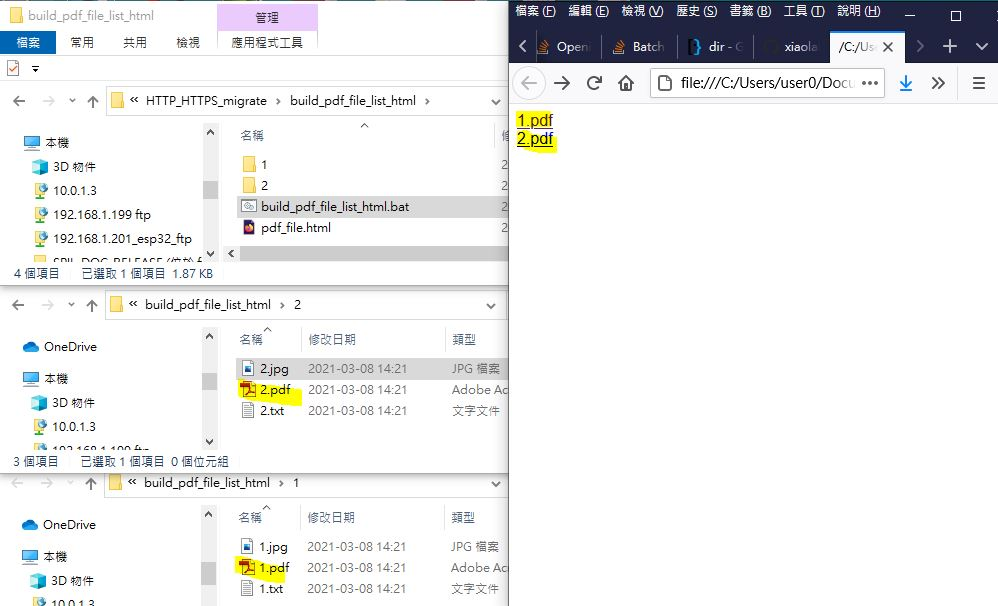

# build_pdf_file_list_html
uses windows BATCH file to build static html for file list of the current folder/sub folder, only pdf file is desired  

### result

### the bat file,
    @echo off
    REM xiaolaba, 2021-MAR-08
    REM %%a = current folder name, this is comment line, no execution
    REM %%b = each file name, this is comment line, no execution

    setlocal enabledelayedexpansion

    REM current folder as root
    set "basefolder=%cd%                                                        

    pushd "%basefolder%"
    (                                                                           REM comments below for each line
    For /F "EOL= Tokens=* Delims= " %%a in ('Dir /B/AD/ON "*" ') do (           REM process every folder in sorted order for process
    REM for /d /r %%a in (*) do (                                               REM no sort folder for process, not used
        pushd "%%a"       
    REM    echo going into "%%a"                                                REM show current older name, go to process
        for /r %%b in (*) do (
    REM      if "%%~xb"==".pdf" (                                                  REM filter out PDF file name only
           if "%%~xb"==".jpg" (                                                 REM filter out JPG file name only
    REM       echo %%b                                                          REM show each file name
           set "relfolder=%%a"                                                  REM build html string
           set "relfolder=!relfolder:%basefolder%\=!"
           set "relfolder=!relfolder:\=/!"
           set "filename=%%~nb"   
           set "filename=!filename: =%%20!"     
    REM          echo ^<li^>^<a href="http://link-to-file.com/!relfolder!/!filename!%%~xb"^>%%~nb^</a^>^</li^>   
              echo ^<a href="!relfolder!/!filename!%%~xb"^>%%~nb%%~xb^</a^>^</br^>
          )
        )
       popd
    REM   echo leaving foler "%%a"                                              REM show current older name, complete process
    )
    REM build html file
    )>"pdf_file.html"                                                           

    echo done

    :: run html file, browser will be opened automatically
    start pdf_file.html                                                         

    pause

   
